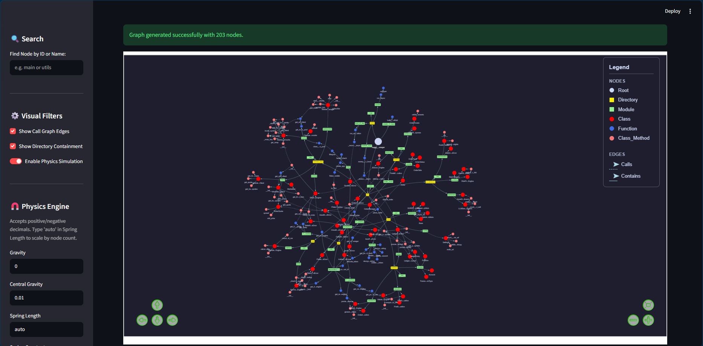

# Results for Interviewer  
* **Reports**  
Generated repots by the agentic code reviewer are stored in the `reports/` directory. You can view them in your browser. The reports are organized by client. [Example Report](reports/CohereClient_reports/review_report.md)
* **Logs**  
The complete prompt and response for every run are saved in log files named after the respective critic. You can check these if anything goes wrong. Token consumption and the selected model are also logged for easy monitoring. [Example Log File](logs/architecture_critic.log)
* **Evaluations**
The evaluation results are stored in the `evaluations/` directory. You can view them to assess the performance of the agentic code reviewer. [Example Evaluation](evaluations/gemini-3.5-flash-lite/name_buggy_fintech_portfolio_manager/branch_auth-and-crypto-hardening.log), [Scores](evaluations/gemini-3.5-flash-lite/name_buggy_fintech_portfolio_manager/evaluation_scores.json)

# CONTENT

 - [Quick Introduction](#quick-introduction)
 - [I can boast about](#i-can-boast-about)
 - [Introduction to users](#introduction-to-users)
 - [Quickstart](#quickstart)
 - [Introduction to developers](#introduction-to-developers)
 - [Full Guide](#full-guide)
 - [Evaluations](#evaluations)

# Quick Introduction

* Get a code review before pushing changes to production. Save valuable senior engineer time by catching rookie mistakes early.
* View a graphical visualization of your repository.

# I can boast about

* I have built the fastest codebase graph builder for Python codebases using `ast`. It can build a 1000-node graph in under 5 seconds.

# Introduction to users

1. **How this Agentic reviewer works:** It converts the whole repository into a directed graph. Nodes are named using their `fqn` to grab the correct context later. It detects newly added or modified nodes (classes, methods, and functions at any nesting level). It grabs the full definition of the changed entity by analyzing the `git diff`. Using the graph, it fetches all nodes connected via `calls` and `called_by` edges. Finally, domain-expert agents scrutinize the code. By default, we have three experts set up:
    * `LOGIC` critic
    * `ARCHITECTURE` critic
    * `SECURITY` critic


2. Currently, it `only supports python` codebases. Support for more languages will be added in future updates.

# Quickstart

1. **Clone** the repo locally.
2. **Delete** `evaluations/`, `logs/`, `reports/`, and `.gitignore`. You do not need them as they are leftovers from my trial runs.
3. **Graph visualization** NOTE: Currently only works for Python codebases.
    ```python
    from codebase_map import launch_gui
    from pathlib import Path

    project_path = r'../document_align'
    project_path = r'../huggingface_transformer_clone/transformers/src/transformers/generation'
    project_path = r'../buggy_fintech_portfolio_manager'
    absolute_path = Path(project_path).absolute().resolve()

    launch_gui(absolute_path)

    ```
    


4. **Code Review**
    ```python
    from pathlib import Path

    from agentic_code_reviewer.clients import (
        OpenAIClient,
        GeminiClient,
        GroqClient,
        MistralClient,
        CerebrasClient,
        OpenRouterClient
    )
    from agentic_code_reviewer.my_langgraph import create_code_review_agent, default_code_review_agent
    from agentic_code_reviewer.paths import REPORTS_DIR_PATH


    project_path = r'../document_align'
    project_path = r'../huggingface_transformer_clone/transformers/src/transformers/generation'
    project_path = r'../buggy_fintech_portfolio_manager'

    absolute_path = Path(project_path).resolve()

    client = GeminiClient()
    # client = OpenAIClient()
    # client = GroqClient()
    # client = MistralClient()
    # client = CerebrasClient()
    # client = OpenRouterClient()

    agent = default_code_review_agent(client=client)

    final_state = run_code_review(
        agent=agent,
        absolute_project_path=project_path,
        report_dir=REPORTS_DIR_PATH / f"{client.__class__.__name__}_reports",
        require_linter=False
    )

    ```


# Introduction to developers

* **How this Agentic reviewer works:**
    * **Context Grabbing:**
        * **Code Context:** To find an issue, analyzing only the changed function block is not enough. That function is called in many places and uses other functions itself. Issues can arise at any level. While there is no hard limit on traversal depth, we only analyze the first child and first parent of the changed function to minimize context size.
        * **Codebase Context:** Code context is enough for simple hobby projects. However, larger complex codebases require a bird's-eye view. This includes understanding the project's goal, file structure, and package responsibilities. A proper codebase context file should be placed in the target directory. The agentic reviewer will grab it automatically if present, or print a warning if missing.
        * **Linter Context:** Your agentic code reviewer might perform simple linter tasks, wasting tokens and compute. To prevent this, provide a linter report in the context. The agent is instructed to ignore already discovered linter findings. This works perfectly but massively increases prompt tokens, so use it wisely. It is highly advised to run a linter and fix basic complaints before using this reviewer.


    * **Agent Workflow:**
        * **Agent Creation:** We can create as many agents as required (e.g., security, logic, architecture). These agents receive the context above and produce structured outputs. An arbitrator agent then processes these outputs. The arbitrator is purely logic-based and does not use a language model. It filters issues by confidence and creates a beautiful Markdown report from the findings. It utilizes Langgraph.


            ```mermaid
            flowchart TD
                A[Context] --> B[Expert1]
                A --> C[Expert2]
                A --> D[Expert3]
                A --> E[Expert4]
                B --> F[Arbitrator]
                C --> F
                D --> F
                E --> F
                F --> G[Markdown Report]

            ```


* **Observation:** The complete prompt and response for every run are saved in log files named after the respective critic. You can check these if anything goes wrong. Token consumption and the selected model are also logged for easy monitoring. [Example Log File](logs/logic_critic.log)
* **Features:**
    * **Graphical Visualization of the Codebase:** We built a codebase graph to grab proper context. You can visualize this graph in the browser using Streamlit.
    * **Custom Agents:** Employ as many experts as needed. To create an agent, supply its system prompt, expected behavior, critic name, and the client with a specific model selected.
    * **Available Clients:** The following clients are available for use:
        * OpenAI
        * Gemini
        * Groq
        * Mistral
        * Cerebras
        * OpenRouter


    * **Supported Models:** You can use any model provided by a particular client. I have also made a model registry that you can view using this method. See the `ClientInterface` for more features.

        ```python
        from agentic_code_reviewer.clients import (
                ClientInterface,
                OpenAIClient,
                GeminiClient,
                GroqClient,
                MistralClient,
                CerebrasClient,
                OpenRouterClient
            )
        ClientInterface.show_all_models()
        # OR
        GeminiClient.show_models()

        client = GeminiClient()
        #OR
        client = GeminiClient(model_name="gemini-3.5-flash")

        ```


# Full Guide

1. **Installation**
    * **Clone** the repo locally.
    * **Delete** `evaluations/`, `logs/`, `reports/`, and `.gitignore`. You do not need them as they are leftovers from my trial runs.
    * **Install** the dependencies using pip.

        ```bash
        pip install -r requirements.txt
        ```


2. **Graph visualization** NOTE: Currently only works for Python codebases.
If the graph has too many nodes, it may take a while to load in the browser. We advise using a smaller codebase for this feature. A hard limit of 2000 nodes is applied. If the codebase exceeds 2000 nodes, it will not be visualized, and a warning will print in the terminal instead.

    ```python
    from codebase_map import launch_gui
    from pathlib import Path

    project_path = r'../document_align'
    project_path = r'../huggingface_transformer_clone/transformers/src/transformers/generation'
    project_path = r'../buggy_fintech_portfolio_manager'
    absolute_path = Path(project_path).absolute().resolve()

    launch_gui(absolute_path)

    ```


3. **Code Review**
    ```python
    from pathlib import Path


    from agentic_code_reviewer import (
        create_code_review_agent, default_code_review_agent,
        run_code_review,
        OpenAIClient,
        GeminiClient,
        GroqClient,
        MistralClient,
        CerebrasClient,
        OpenRouterClient,
        AgentFactory
    )
    from agentic_code_reviewer.paths import REPORTS_DIR_PATH

    project_path = r'../document_align'
    project_path = r'../huggingface_transformer_clone/transformers/src/transformers/generation'
    project_path = r'../buggy_fintech_portfolio_manager'

    absolute_path = Path(project_path).resolve()

    client = GeminiClient()
    # client = OpenAIClient()
    # client = GroqClient()
    # client = MistralClient()
    # client = CerebrasClient()
    # client = OpenRouterClient()

    agent = default_code_review_agent(client=client)

    final_state = run_code_review(
        agent=agent,
        absolute_project_path=project_path,
        report_dir=REPORTS_DIR_PATH / f"{client.__class__.__name__}_reports",
        require_linter=False
    )

    ```


4. **Make Custom Agents:** Employ as many experts as needed. To create an agent, supply its system prompt, expected behavior, critic name, and the client with a specific model selected.

    ```python
    from agentic_code_reviewer import (
        OpenAIClient,
        GeminiClient,
        GroqClient,
        MistralClient,
        CerebrasClient,
        OpenRouterClient,
        create_code_review_agent,
        AgentFactory
    )

    gemini_client = GeminiClient()
    openai_client = OpenAIClient()
    # groq_client = GroqClient()
    # mistral_client = MistralClient()
    # cerebras_client = CerebrasClient()
    # openrouter_client = OpenRouterClient()

    expert1_name = "expert1"
    expert1_category = "expert1_category"
    expert1_sys_prompt = "expert1 system prompt"
    expert2_name = "expert2"
    expert2_category = "expert2_category"
    expert2_sys_prompt = "expert2 system prompt"
    expert3_name = "expert3"
    expert3_category = "expert3_category"
    expert3_sys_prompt = "expert3 system prompt"
    expert4_name = "expert4"
    expert4_category = "expert4_category"
    expert4_sys_prompt = "expert4 system prompt"

    agent_factories = [AgentFactory(
                        name=name, 
                        category=category, 
                        system_prompt=system_prompt, 
                        client=openai_client
                        ) 
                        for name, category, system_prompt in 
                        [(expert1_name, expert1_category, expert1_sys_prompt),
                        (expert2_name, expert2_category, expert2_sys_prompt),
                        (expert3_name, expert3_category, expert3_sys_prompt),
                        (expert4_name, expert4_category, expert4_sys_prompt)]
    ]

    ```


# Evaluations

### First Approach: Open-Source Repository (Failed)

Initially, I attempted to evaluate the agent using large, actively maintained open-source Python repositories. I ran evaluations on the Hugging Face Transformers repository. I extracted ground truth data from contributor comments, maintainer commits, and specific code selections.

This approach ultimately failed. Commit comments were often not descriptive (e.g., just saying "done"). Furthermore, real, straightforward logical bugs are rarely exposed in repositories of this scale. Most issues involved minor architectural improvements or adding support for new models and frameworks. The agentic reviewer could not identify these issues because they often relied on compatibility with external services missing from the codebase context.

### Second Approach: Dummy Fintech Repository (Success)

Because the open-source approach lacked clear ground truth, I created an extensive [Dummy Fintech Portfolio Manager Repository(click to view)](https://github.com/RHMTshaikh/buggy_fintech_portfolio_manager.git). I intentionally introduced various bugs of different difficulty levels.

This dummy repository is publicly available on GitHub, complete with documentation of the injected issues. I created eight separate branches for this repository. In each branch, I introduced three to five issues. I also included non-critical, benign changes to test the model on false positive cases.

---

**Evaluation Results:** The evaluation results are stored in the `evaluations/` directory.

See --> [Evaluation Results](evaluations/gemini-3.5-flash-lite/name_buggy_fintech_portfolio_manager/branch_accounting-ledger-update.log)  
See --> [Evaluation Scores](evaluations/gemini-3.5-flash-lite/name_buggy_fintech_portfolio_manager/evaluation_scores.json)  
See --> [Evaluation Scores](logs/architecture_critic.log#L396400)  

**Structure of Evaluation Data**

```Python
class EvaluationScores(BaseModel):
    """Nested schema for the detailed evaluation scores."""
    model_config = {"extra": "forbid"}
    
    recall: int = Field(description="Score from 0 to 4 based on the number of ground truth issues successfully found.")
    root_cause: int = Field(description="Score from 0 to 3 evaluating if the systemic impact was correctly explained according to the repository context.")
    false_positive_penalty: int = Field(description="Penalty from -3 to 0 for falsely flagging benign code changes as critical bugs.")
    hallucination_penalty: int = Field(description="Penalty from -2 to 0 for inventing code not present in the diff or asserting fake bugs.")
    actionability: int = Field(description="Score from 0 to 2 evaluating if the remediation steps are clear, correct, and safe to apply.")
    discovery_bonus: int = Field(description="Bonus from 0 to 2 for identifying legitimate, severe flaws that were not listed in the Ground Truth.")

class FindingEvaluation(BaseModel):
    model_config = {"extra": "forbid"}

    original_review_finding_identifier: str = Field(description="Unique identifier description of the issue found by the review agent.")
    issue_id: Optional[int] = Field(description="Issue ID of the corresponding ground truth issue if it was successfully matched. None if not detected.")
    severity_correct: Optional[bool] = Field(description="Whether the severity level was correctly assessed. None if not detected.")
    category_correct: Optional[bool] = Field(description="Whether the category was correctly assessed. None if not detected.")
    description_correct: Optional[bool] = Field(description="Whether the description of issue correctly represents the problem described in the ground truth.")
    remediation_quality: Optional[str] = Field(description="Assessment of the suggested remediation steps. None if not detected.")
    false_positive_flagged: bool = Field(description="Whether the agent incorrectly flagged a safe, benign change as a bug.")

class EvaluatorResponse(BaseModel):
    """The strict JSON schema the LLM must follow when evaluating the agent."""
    model_config = {"extra": "forbid"}
    
    finding_evaluations: list[FindingEvaluation]
    missed_ground_truths_ids: list[int] = Field(description="List of issue IDs of the ground truth issues that the agent failed to identify.")
    reasoning: str = Field(description="Step-by-step logical breakdown of the comparison before scoring.")
    score: EvaluationScores = Field(description="The overall evaluation scores.")

```

## Scores

* **Review Agent:** openai/gpt-oss-120b
* **Ground Truth Repository:** [Dummy Fintech Portfolio Manager](https://github.com/RHMTshaikh/buggy_fintech_portfolio_manager.git)
* **Evaluation Agent:** Gemini-3.5-flash-lite
    * **Scores for all branches**
    * **recall**: [2, 0, 3, 0, 0, 4, 2, 2, 1]
    * **root_cause**: [2, 0, 2, 0, 0, 3, 2, 2, 2]
    * **false_positive_penalty**: [ -2, -1, 0, 0, -1, 0, -1, -1, -2]
    * **hallucination_penalty**: [0, 0, 0, 0, 0, 0, 0, 0, 0]
    * **actionability**: [2, 1, 2, 0, 1, 2, 2, 2, 2]
    * **discovery_bonus**: [0, 0, 0, 0, 0, 0, 0, 0, 0]


* **Average Scores**

| parameter | value | range |
| --- | --- | --- |
| **recall** | 1.56 | 0 - 4 |
| **root_cause** | 1.44 | 0 - 3 |
| **false_positive_penalty** | -0.89 | -3 - 0 |
| **hallucination_penalty** | 0.0 | -2 - 0 |
| **actionability** | 1.56 | 0 - 2 |
| **discovery_bonus** | 0.0 | 0 - 2 |
| **Overall Score** | 7.37 | -5 - 11 |


**Which amounts to 77% of the maximum possible score.**
> It would score much higher if I had not hit rate limit errors. I used free-tier models that ran fine when the context was under 8k tokens. This caused the 0 scores in several branches. I will implement a fallback mechanism in future updates. This will use a smaller model when the context is under 8k tokens and a larger model for contexts over 8k tokens, significantly improving the overall score.